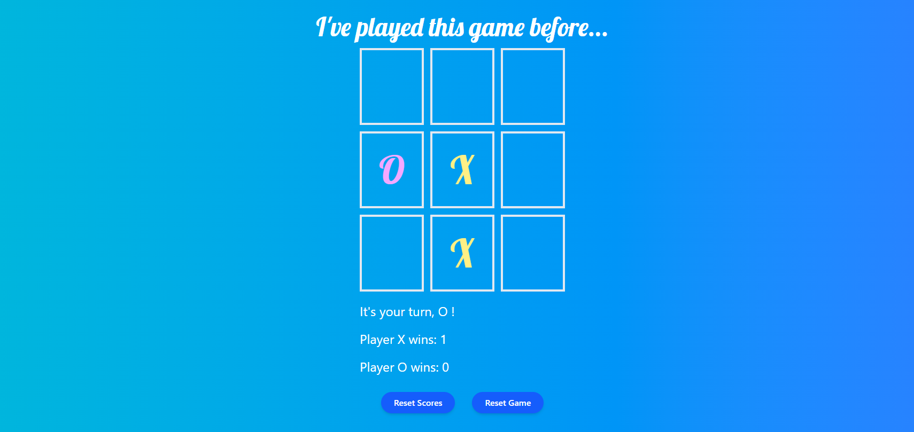

# mini tic-tac-toe

## I'm learning react + typescript + tailwind css so I looked it up online for some projects and then I found [this one](https://www.youtube.com/watch?v=MRe-5nVBPRo)

## I also added some methods like reseting the board, the scores and even preventing the winner to spam-click on the board and showing 3 or 4 winning alerts

## Screenshots 📸
Here's a screenshot and [a link](https://tic-tac-toe-react-hazel-seven.vercel.app/) to try for yourself.

